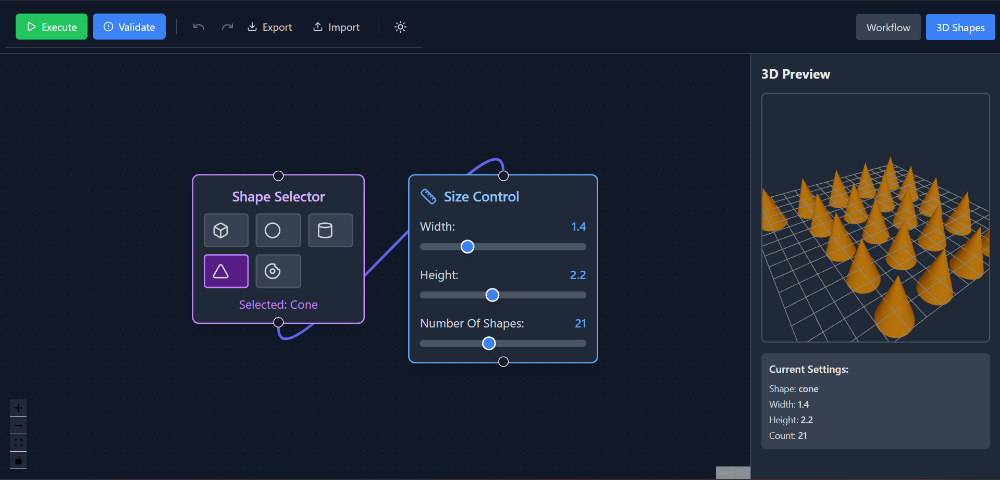
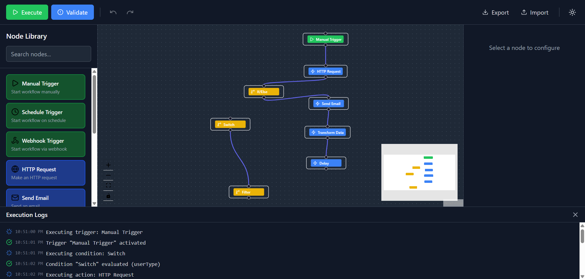
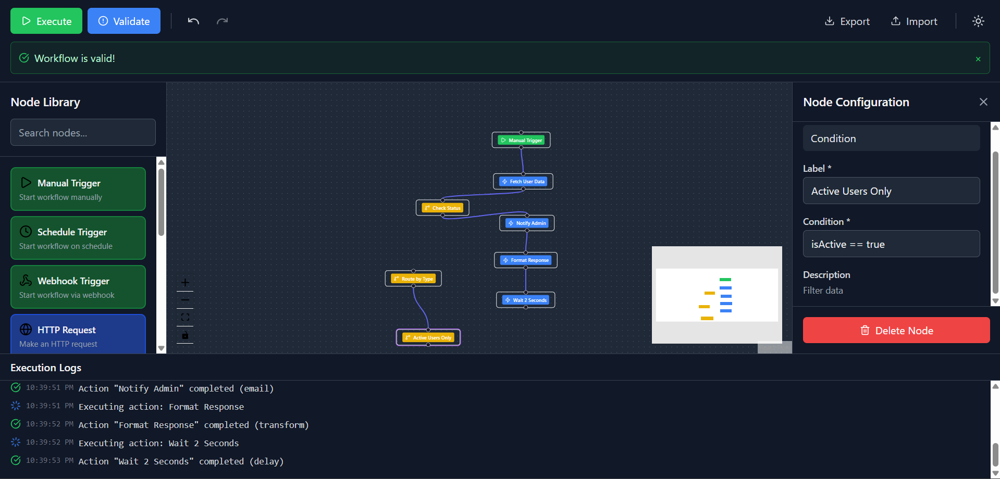
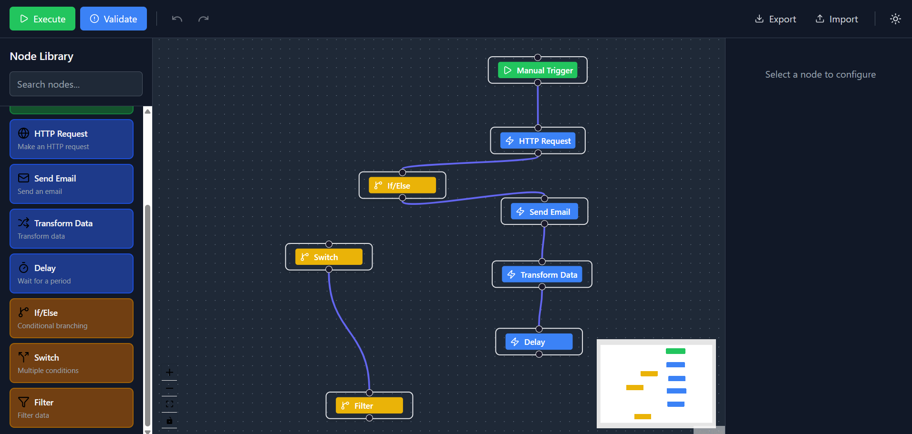

# Visual Workflow Automation Builder

A powerful, frontend-only visual workflow automation builder built with React and TypeScript. Create, configure, validate, and simulate complex workflows entirely in your browser.

  

---

## 📸 Application Screenshots

### 3D Shape Workflow

*Interactive 3D shape visualization workflow featuring a node-based interface. Select shapes (cube, sphere, cylinder, cone, torus) in the Shape Selector node, adjust dimensions and quantity in the Size Control node, and view real-time 3D rendering with up to 30 shapes arranged in a smart grid. Features auto-rotating camera, dynamic lighting, and responsive layout that adapts to the number of shapes.*

**3D Workflow Features:**
- **Shape Selection**: 5 different 3D shapes with visual icons
- **Size Control**: Width, height, and shape count (1-30) with sliders
- **Real-time 3D Preview**: Interactive Three.js rendering with orbit controls
- **Smart Grid Layout**: Automatic arrangement based on shape count
- **Dark Theme Support**: Consistent theming across all components

### Workflow Execution View

*Complete workflow with execution logs showing real-time processing. Features visible: Node Library (left), Canvas with connected nodes (center), MiniMap (bottom right), and Execution Logs panel (bottom) displaying timestamped execution steps.*

**Workflow Flow:**
```
Manual Trigger → HTTP Request → If/Else → Send Email → Transform Data → Delay → Filter
                                    ↓
                                 Switch
```

### Node Configuration Panel

*Node Configuration panel showing condition node setup with validation success banner. Configure node properties including Label, Condition logic (isActive == true), and Description. Features Delete Node button for easy removal.*

**Visible Workflow:**
```
Manual Trigger → Fetch User Data → Check Status → Notify Admin → Format Response → Wait 2 Seconds → Active Users Only
                                       ↓
                                  Delay by Type
```

### Available Node Types

*Complete library of available node types organized by category: Triggers (green), Actions (blue), and Conditions (yellow). Drag and drop any node from the sidebar to the canvas to build your workflow.*

### Light Theme Interface

*Clean, professional light theme interface showing the complete workflow builder with sidebar, canvas, and configuration panels. Toggle between light and dark themes with the theme switcher in the toolbar.*

---

## 🚀 Features

### Core Functionality
- ✅ **Visual Workflow Designer**: Drag-and-drop interface for building workflows
- ✅ **3D Shape Visualization**: Interactive 3D rendering with Three.js
- ✅ **10 Node Types**: Triggers, Actions, and Conditions
- ✅ **Real-time Validation**: Detect cycles, missing triggers, and configuration errors
- ✅ **Execution Simulation**: Step-by-step workflow execution with visual feedback
- ✅ **Undo/Redo**: Full history management (50 states) with keyboard shortcuts
- ✅ **Auto-save**: Automatic persistence to localStorage every 500ms
- ✅ **Import/Export**: Save and load workflows as JSON files
- ✅ **Dark/Light Mode**: Professional theme switching
- ✅ **Execution Logs**: Real-time logs with timestamps and status

### Technical Highlights
- 🧠 **Graph Algorithms**: Topological sorting and cycle detection (DFS)
- 🔄 **State Management**: Zustand with immutable updates via Immer
- 🛡️ **Type Safety**: Strict TypeScript mode enabled
- ⚡ **Performance**: Optimized for 50+ nodes
- 🎨 **Modern UI**: Tailwind CSS with responsive design
- 📦 **No Backend**: Runs entirely in the browser
- 🎯 **3D Graphics**: Three.js integration for shape visualization

---

## 📋 Prerequisites

- **Node.js** 18 or higher
- **npm** (comes with Node.js) or **yarn**
- Modern web browser (Chrome, Firefox, Safari, Edge)

---

## 🛠️ Installation & Setup

### Step 1: Clone or Download
```bash
# Navigate to project directory
cd workflow-builder
```

### Step 2: Install Dependencies
```bash
npm install
```

**Core Dependencies Installed:**
- `react` (^19.2.0) - UI framework
- `react-dom` (^19.2.0) - React DOM rendering
- `reactflow` (^11.11.4) - Visual workflow canvas
- `zustand` (^5.0.11) - State management
- `immer` (^11.1.4) - Immutable state updates
- `lucide-react` (^0.575.0) - Icon library
- `tailwindcss` (^3.4.1) - CSS framework
- `three` - 3D graphics library
- `@react-three/fiber` - React Three.js renderer
- `@react-three/drei` - Three.js helpers

### Step 3: Start Development Server
```bash
npm run dev
```

**Open in browser:** http://localhost:5173

### Build for Production

```bash
# Create optimized production build
npm run build

# Preview production build locally
npm run preview
```

---

## 🎮 Quick Start Guide

### 1. Create Your First Workflow

**Step 1:** Drag "Manual Trigger" from sidebar to canvas
**Step 2:** Drag "HTTP Request" below it
**Step 3:** Connect them (drag from bottom circle to top circle)
**Step 4:** Click node to configure
**Step 5:** Click "Validate" to check for errors
**Step 6:** Click "Execute" to run!

### 2. Try the 3D Shape Workflow

**Step 1:** Click "3D Shapes" button in the top toolbar
**Step 2:** Select a shape in the Shape Selector node
**Step 3:** Adjust width, height, and number of shapes
**Step 4:** Watch the real-time 3D preview update!

---

## 📦 Node Types (10 Total)

### 🟢 Triggers (3 types)
Start points for your workflow

| Node | Description | Icon |
|------|-------------|------|
| **Manual Trigger** | Start workflow manually | ▶️ |
| **Schedule Trigger** | Time-based execution | ⏰ |
| **Webhook Trigger** | HTTP endpoint trigger | 🔗 |

### 🔵 Actions (4 types)
Operations that do work

| Node | Description | Icon |
|------|-------------|------|
| **HTTP Request** | Make API calls | 🌐 |
| **Send Email** | Email notifications | 📧 |
| **Transform Data** | Data manipulation | 🔄 |
| **Delay** | Wait/pause execution | ⏱️ |

### 🟡 Conditions (3 types)
Decision points in your workflow

| Node | Description | Icon |
|------|-------------|------|
| **If/Else** | Binary decision | 🔀 |
| **Switch** | Multiple conditions | 🔱 |
| **Filter** | Data filtering | 🔍 |

---

## 🎯 Example Workflows

### Example 1: Simple Data Processing
```
Manual Trigger → HTTP Request → Send Email
```

### Example 2: Conditional Flow
```
Manual Trigger → HTTP Request → If/Else → Transform Data → Send Email
```

### Example 3: 3D Shape Visualization
```
Shape Selector → Size Control → 3D Preview
```

---

## ✅ Validation Features

### What Gets Validated:

1. ✅ **At least one Trigger node** must exist
2. ✅ **No circular dependencies** (cycle detection)
3. ✅ **All required fields** must be filled
4. ✅ **Valid connections** between nodes
5. ⚠️ **Orphaned nodes** warning (not connected)

---

## 🎬 Execution Features

### Visual Feedback:
- 🔵 **Blue pulse animation** on currently executing node
- 🟣 **Purple animated lines** showing data flow
- ✅ **Green checkmarks** in logs for success
- ❌ **Red X marks** for errors
- ⏱️ **Timestamps** for each step

---

## 🔄 Undo/Redo

### Keyboard Shortcuts:
- `Ctrl+Z` (Windows) / `Cmd+Z` (Mac): **Undo**
- `Ctrl+Y` (Windows) / `Cmd+Shift+Z` (Mac): **Redo**

### Features:
- ✅ Stores last 50 actions
- ✅ Works for all operations (add, delete, move, configure)
- ✅ Visual feedback in toolbar (buttons enable/disable)

---

## 💾 Save & Load

### Auto-Save:
- ✅ Saves automatically every 500ms
- ✅ Persists to browser localStorage
- ✅ No data loss on refresh
- ✅ Works offline

### Export:
- Downloads workflow as JSON file
- Includes version and timestamp
- Shareable with team

### Import:
- Load previously exported workflows
- Validates JSON structure
- Restores all nodes and connections

---

## 🎨 Themes

Toggle between light and dark themes with one click!

**Features:**
- ✅ Smooth transitions
- ✅ Preference saved automatically
- ✅ All components themed
- ✅ Readable in both modes

---

## 🗺️ Canvas Controls

### Zoom & Pan:

**Controls:**
- ➕ Zoom In
- ➖ Zoom Out
- 🎯 Fit View
- 🗺️ MiniMap (bottom right)

### MiniMap:

**Features:**
- 🟢 Green dots = Triggers
- 🔵 Blue dots = Actions
- 🟡 Yellow dots = Conditions
- Click and drag to navigate

---

## 🏗️ Architecture

### Project Structure
```
src/
├── components/          # React components
│   ├── Sidebar/        # Node library panel
│   ├── Canvas/         # Workflow canvas (ReactFlow)
│   │   ├── CustomNode.tsx      # Standard workflow nodes
│   │   ├── ShapeNode.tsx       # 3D shape selector
│   │   ├── SizeNode.tsx        # Size control sliders
│   │   ├── Viewer3D.tsx        # Three.js 3D renderer
│   │   └── Shape3DWorkflow.tsx # 3D workflow container
│   ├── ConfigPanel/    # Node configuration
│   └── common/         # Toolbar, ExecutionPanel
├── features/           # Business logic
│   ├── workflow/       # Node templates
│   ├── validation/     # Validation engine
│   ├── execution/      # Execution simulator
│   └── persistence/    # Save/load logic
├── store/              # Zustand state management
├── types/              # TypeScript definitions
├── utils/              # Graph algorithms, validators
└── hooks/              # Custom React hooks
```

### Tech Stack

| Technology | Purpose |
|------------|---------|
| **React 18** | UI framework |
| **TypeScript** | Type safety |
| **Zustand** | State management |
| **ReactFlow** | Canvas & nodes |
| **Three.js** | 3D graphics |
| **@react-three/fiber** | React Three.js |
| **Tailwind CSS** | Styling |
| **Immer** | Immutable updates |
| **Vite** | Build tool |

---

## 📊 Performance

- ✅ Optimized for **50+ nodes**
- ✅ Memoized components (React.memo)
- ✅ Efficient algorithms (O(V + E))
- ✅ Debounced auto-save
- ✅ Smooth animations (60fps)
- ✅ 3D rendering optimization

---

## 🔒 Data Privacy

- ✅ **100% client-side** - No backend required
- ✅ **Local storage only** - Data never leaves your browser
- ✅ **No tracking** - No analytics or telemetry
- ✅ **Offline capable** - Works without internet

---

## 🐛 Known Limitations

- Maximum 50 undo/redo states
- localStorage limit (~5-10MB)
- Simulation only (no real API calls)
- Optimized for desktop (tablet works, mobile limited)
- 3D rendering requires WebGL support

---

## 🚧 Future Enhancements

- [ ] Real backend integration
- [ ] Collaborative editing (WebSockets)
- [ ] Custom node creation UI
- [ ] Workflow templates library
- [ ] Advanced 3D shapes and materials
- [ ] VR/AR support for 3D workflows
- [ ] Performance monitoring
- [ ] Plugin architecture

---

## 📝 License

MIT License - Free to use for learning or commercial purposes.

---

## 🤝 Contributing

Contributions welcome! Please:

1. Fork the repository
2. Create a feature branch
3. Commit your changes
4. Push to the branch
5. Open a pull request

---

## 📧 Support

For issues and questions, please open an issue on GitHub.

---

## 🙏 Acknowledgments

- **ReactFlow** - Excellent canvas library
- **Three.js** - Powerful 3D graphics
- **Zustand** - Simple state management
- **Tailwind CSS** - Rapid styling
- **Lucide React** - Beautiful icons

---

**Built with ❤️ using React, TypeScript, and Three.js**